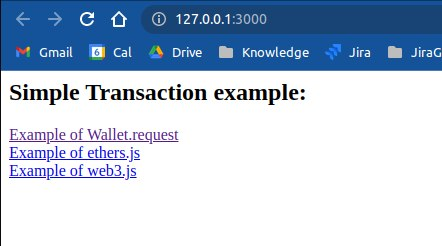
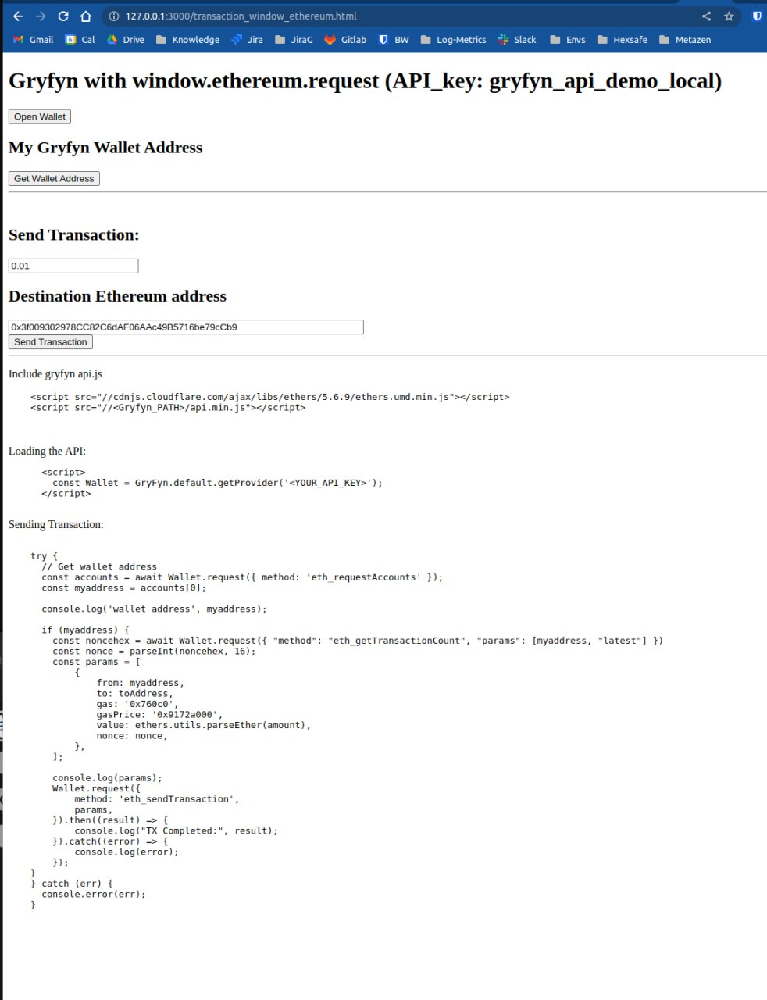
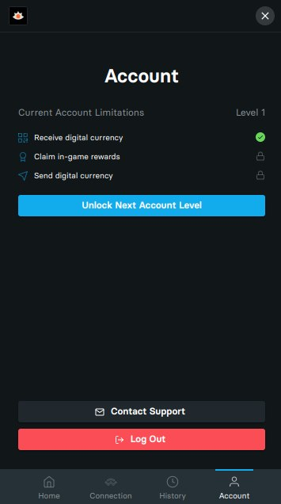

# Gryfyn Web3 provider

For detailed document, please read the [userguide.md](userguide.md) for detail.

## Demo:

The API Key `gryfyn_api_demo_local` is whitelisted with

```
http://localhost
http://localhost:8000
http://localhost:8080
http://localhost:3000
http://127.0.0.1
http://127.0.0.1:8000
http://127.0.0.1:8080
http://127.0.0.1:3000

```

## Start http-server locally

To start the demo, you can use any web server to host the examples folder in port 80, 3000, 8080, 8000. 

using [http-server](https://www.npmjs.com/package/http-server) for example 

```
npx http-server -p 3000 examples/
```

Feel free to View source for the implementation.

## Open http://localhost:3000 with your browser

*You should see this*



## Click any of the links

Click any of the 3 links. eg. if you click the first you will see a test demo page



Click open wallet and can login (needed first)

Then you can eg. from the web page call a send tx

Please just remember to let us know any addresses you wish to deposit from or withdraw to, as we have to whitelist for compliance (transaction risk scoring is not available in testnet)

## KYC 



To do 'send transaction' call the Gryfyn user must have passed KYC and have activated 2fa from this page

in sandbox KYC must be approved manually so pls post here the users you would like us to approve