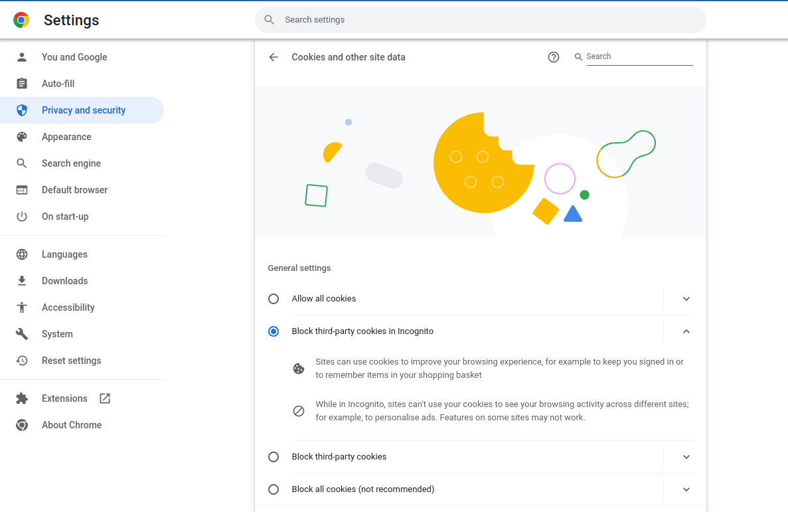

# Gryfyn Web3 provider

For detailed documentation on how to integrate this SDK, please read the [userguide.md](userguide.md) for details.

## API Support
In order to obtain support for the API and for any queries, there are several parameters that Hex Trust will need to know. If you are interested in integrating with the Gryfyn wallet or would like to provide domains and addresses to be whitelisted, please contact integrations@hextrust.com.

## Demo:

The API Key `gryfyn_api_demo_local` is whitelisted with

```
http://localhost
http://localhost:8000
http://localhost:8080
http://localhost:3000
http://127.0.0.1
http://127.0.0.1:8000
http://127.0.0.1:8080
http://127.0.0.1:3000

```

## Start http-server locally

To start the demo, you can use any web server to host the examples folder in port 80, 3000, 8080, 8000. 

using [http-server](https://www.npmjs.com/package/http-server) for example 

```
npx http-server -p 3000 examples/
```

Feel free to View source for the implementation.


### Important pre-requisite
_Make sure cookies from third parties are allowed in your browser_.    
Using Chrome as an example, the cookies setting should be either of: 
* `Block third-party cookies in Incognito` (navigate in normal tab with this setting)
* `Allow all cookies`



<br>

## Open http://localhost:3000 with your browser

*You should see this*


<br>

## Click any of the links

Click any of the 3 links. eg. if you click the first you will see a test demo page


Click open wallet and can login (needed first)

Then you can trigger actions from the web page such as send transaction

Please just remember to let us know any addresses you wish to deposit from or withdraw to, as we have to whitelist for compliance (transaction risk scoring is not available in testnet)

<br>

## KYC 


To do 'send transaction' call the Gryfyn user must have passed KYC and have activated 2fa from this page

in sandbox KYC must be approved manually so please send an email with the addresses you would like to approve to this email: integrations@hextrust.com 
